# Smart Expense AI Platform

A full-stack starter project with:
- **Angular 21** frontend
- **Spring Boot 4.0.5** backend
- **FastAPI** ML service

## Features
- Add, edit, delete daily expenses
- Weekly and monthly chart data
- Category-wise chart data
- Predict next month spending
- Detect unusually high expenses

## Project structure
- `frontend-angular` — Angular UI
- `backend-springboot` — Spring Boot REST API
- `ml-service-python` — Python ML/prediction service

## Prerequisites
- Node.js compatible with Angular 21 (Node 20.19+, 22.12+, or 24+)
- Java 21+
- Maven 3.9+
- Python 3.11+
  
## Architecture



## Screenshots

  ### Dashboard
  

  ### Add Expense
  

  ### Monthly Analytics
  

## Run order

### 1) Start ML service
```bash
cd ml-service-python
python -m venv .venv
# Windows
.venv\Scripts\activate
# macOS/Linux
source .venv/bin/activate
pip install -r requirements.txt
uvicorn app.main:app --reload --port 8000
```

### 2) Start Spring Boot backend
```bash
cd backend-springboot
mvn spring-boot:run
```
Backend runs on `http://localhost:8080`

### 3) Start Angular frontend
```bash
cd frontend-angular
npm install
npm start
```
Frontend runs on `http://localhost:4200`

## Notes
- Backend uses H2 in-memory DB and seeds sample data on startup.
- Angular uses standalone components and `ng2-charts`.
- The ML service uses simple heuristics plus lightweight statistics so it runs fast locally.
