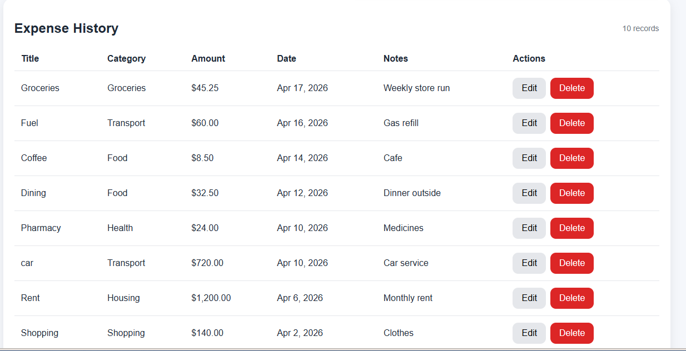
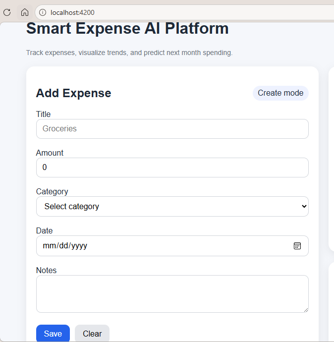
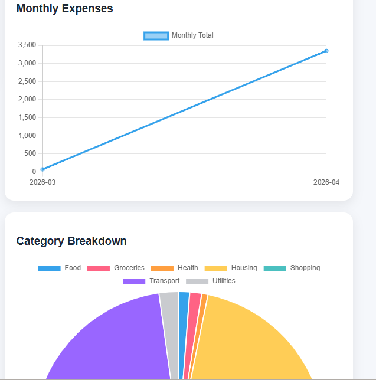

<div align="center">

<br/>

```
███████╗██╗  ██╗██████╗ ███████╗███╗   ██╗███████╗███████╗
██╔════╝╚██╗██╔╝██╔══██╗██╔════╝████╗  ██║██╔════╝██╔════╝
█████╗   ╚███╔╝ ██████╔╝█████╗  ██╔██╗ ██║███████╗█████╗  
██╔══╝   ██╔██╗ ██╔═══╝ ██╔══╝  ██║╚██╗██║╚════██║██╔══╝  
███████╗██╔╝ ██╗██║     ███████╗██║ ╚████║███████║███████╗
╚══════╝╚═╝  ╚═╝╚═╝     ╚══════╝╚═╝  ╚═══╝╚══════╝╚══════╝
```

# 💸 Smart Expense AI Platform

**Track smarter. Spend wiser. Predict the future.**

A full-stack AI-powered expense management platform that tracks your daily spending, visualises trends, and uses machine learning to predict and flag unusual expenses — before they become a problem.

<br/>

[](https://angular.io/)
[](https://spring.io/projects/spring-boot)
[](https://fastapi.tiangolo.com/)
[](https://python.org/)
[](https://openjdk.org/)
[](LICENSE)

<br/>

</div>

---

## ✨ Features at a Glance

| Feature | Description |
|---|---|
| 📝 **Expense Management** | Add, edit, and delete daily expenses with ease |
| 📊 **Weekly & Monthly Charts** | Visualise your spending trends over time |
| 🏷️ **Category Analytics** | Break down spending by category with interactive charts |
| 🔮 **Next Month Prediction** | ML model forecasts your spending for the month ahead |
| 🚨 **Anomaly Detection** | Automatically flags unusually high expenses |

---

## 🏗️ Architecture

```
┌─────────────────────────────────────────────────────┐
│                  👤  User Browser                   │
└────────────────────────┬────────────────────────────┘
                         │  HTTP / REST
                         ▼
┌─────────────────────────────────────────────────────┐
│           🅰️  Angular 21  Frontend                  │
│     Standalone components · ng2-charts · UI/UX      │
│              http://localhost:4200                   │
└────────────────────────┬────────────────────────────┘
                         │  REST API (JSON)
                         ▼
┌─────────────────────────────────────────────────────┐
│         ☕  Spring Boot 4.0.5  Backend              │
│   REST Controllers · Services · JPA Repositories    │
│         H2 In-Memory DB · http://localhost:8080      │
└──────────┬──────────────────────────────────────────┘
           │  Internal REST call
           ▼
┌─────────────────────────────────────────────────────┐
│          🐍  FastAPI  ML Service (Python)           │
│    Prediction Engine · Anomaly Detection · Stats    │
│              http://localhost:8000                   │
└─────────────────────────────────────────────────────┘
```

---

## 📁 Project Structure

```
smart-expense-ai/
│
├── 🅰️  frontend-angular/          # Angular 21 UI application
│   ├── src/app/
│   │   ├── components/            # Standalone components
│   │   ├── services/              # HTTP & state services
│   │   └── models/                # TypeScript interfaces
│   └── package.json
│
├── ☕  backend-springboot/         # Spring Boot REST API
│   ├── src/main/java/
│   │   ├── controller/            # REST endpoints
│   │   ├── service/               # Business logic
│   │   ├── repository/            # JPA data access
│   │   └── model/                 # Entity classes
│   └── pom.xml
│
└── 🐍  ml-service-python/          # FastAPI ML inference service
    ├── app/
    │   ├── main.py                # FastAPI app entry point
    │   ├── predictor.py           # Spending prediction logic
    │   └── anomaly.py             # Anomaly detection logic
    └── requirements.txt
```

---

## 🖥️ Screenshots

<div align="center">

### 📊 Dashboard
> *Real-time overview of all your expenses and AI insights*



---

### ➕ Add Expense
> *Quick and clean expense entry form*



---

### 📈 Monthly Analytics
> *Interactive charts powered by ng2-charts*



</div>

---

## ⚙️ Prerequisites

Make sure you have the following installed before running the project:

| Tool | Version | Purpose |
|---|---|---|
| 🟢 **Node.js** | `20.19+` · `22.12+` · `24+` | Angular frontend runtime |
| ☕ **Java** | `21+` | Spring Boot backend |
| 🔧 **Maven** | `3.9+` | Java build tool |
| 🐍 **Python** | `3.11+` | ML service runtime |

---

## 🚀 Getting Started

> **Important:** Start services in this exact order — ML service → Backend → Frontend

<br/>

### Step 1 — 🐍 Start the ML Service

```bash
cd ml-service-python

# Create and activate a virtual environment
python -m venv .venv

# Windows
.venv\Scripts\activate

# macOS / Linux
source .venv/bin/activate

# Install dependencies
pip install -r requirements.txt

# Start the FastAPI server
uvicorn app.main:app --reload --port 8000
```

> ✅ ML Service running at **http://localhost:8000**  
> 📖 API docs available at **http://localhost:8000/docs**

<br/>

### Step 2 — ☕ Start the Spring Boot Backend

```bash
cd backend-springboot

mvn spring-boot:run
```

> ✅ Backend running at **http://localhost:8080**  
> 🗄️ H2 Console available at **http://localhost:8080/h2-console**

<br/>

### Step 3 — 🅰️ Start the Angular Frontend

```bash
cd frontend-angular

npm install

npm start
```

> ✅ Frontend running at **http://localhost:4200**

---

## 📝 Notes

- **Database** — The backend uses an **H2 in-memory database** and automatically seeds sample data on every startup. No database setup required.
- **Charts** — The Angular frontend uses **ng2-charts** (Chart.js wrapper) for all data visualisations.
- **ML Service** — Uses lightweight statistical heuristics so it runs fast locally without any GPU or heavy model files.
- **Standalone Components** — The Angular app is built with the modern standalone component architecture (no `NgModule`).

---

## 🔮 Future Enhancements

Here's what's coming next on the roadmap:

- [ ] 🔐 **OAuth / JWT Authentication** — Secure user login and session management
- [ ] 📄 **PDF Report Export** — Download monthly expense reports as PDF
- [ ] 🔔 **Recurring Expense Reminders** — Never miss a subscription or bill
- [ ] 🤖 **LLM-Based Smart Suggestions** — AI-powered personalised spending advice
- [ ] 💬 **Finance Chatbot** — Ask questions about your spending in natural language
- [ ] ☁️ **AWS Cloud Deployment** — One-click cloud deployment with CI/CD pipeline

---

## 🛠️ Tech Stack

<div align="center">

| Layer | Technology | Role |
|---|---|---|
| **Frontend** | Angular 21 | SPA, routing, components |
| **Charting** | ng2-charts · Chart.js | Interactive data visualisation |
| **Backend** | Spring Boot 4.0.5 | REST API, business logic |
| **ORM** | Spring Data JPA · Hibernate | Database access layer |
| **Database** | H2 (dev) → PostgreSQL/MySQL (prod) | Data persistence |
| **ML Service** | FastAPI · Python 3.11 | Prediction & anomaly detection |
| **ML Libraries** | scikit-learn · NumPy · statistics | Model & heuristics |
| **Server** | Uvicorn | ASGI server for FastAPI |

</div>

---

## 🤝 Contributing

Contributions, issues, and feature requests are welcome!

1. **Fork** the repository
2. **Create** your feature branch: `git checkout -b feature/amazing-feature`
3. **Commit** your changes: `git commit -m 'Add amazing feature'`
4. **Push** to the branch: `git push origin feature/amazing-feature`
5. **Open** a Pull Request

---

## 📄 License

This project is licensed under the **MIT License** — see the [LICENSE](LICENSE) file for details.

---

<div align="center">

**Built with ❤️ using Angular · Spring Boot · FastAPI**

*If this project helped you, please consider giving it a ⭐ star on GitHub!*

</div>
